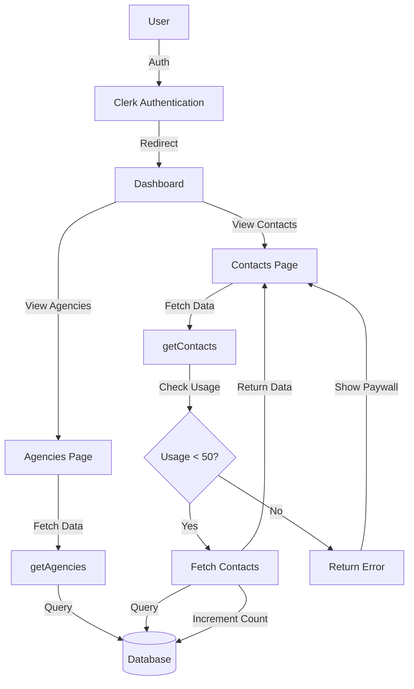

# Agency & Contact Dashboard

A dashboard application built with Next.js 16, Clerk Authentication, and Prisma.

## Features
- **Authentication**: Secure signup/login via Clerk.
- **Agencies**: View a list of agencies (populated from CSV).
- **Contacts**: View employee contacts with a daily usage limit.
- **Usage Limit**: Users are limited to viewing 50 contacts per day.
- **Paywall**: "Upgrade" prompt when the limit is reached.

## Tech Stack
- **Framework**: Next.js 16 (App Router)
- **Language**: TypeScript
- **Styling**: Tailwind CSS + Shadcn/UI
- **Auth**: Clerk
- **Database**: SQLite (Dev) / Prisma ORM

## Setup
1.  Clone the repository.
2.  Install dependencies: `npm install`
3.  Set up environment variables in `.env`:
    ```env
    DATABASE_URL="file:./dev.db"
    NEXT_PUBLIC_CLERK_PUBLISHABLE_KEY=...
    CLERK_SECRET_KEY=...
    NEXT_PUBLIC_CLERK_SIGN_IN_FORCE_REDIRECT_URL=/dashboard/agencies
    NEXT_PUBLIC_CLERK_SIGN_UP_FORCE_REDIRECT_URL=/dashboard/agencies
    ```
4.  Run migrations: `npx prisma migrate dev`
5.  Seed the database: `npx prisma db seed`
6.  Start the server: `npm run dev`

## System Design

